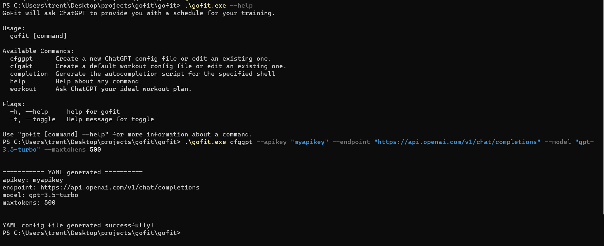
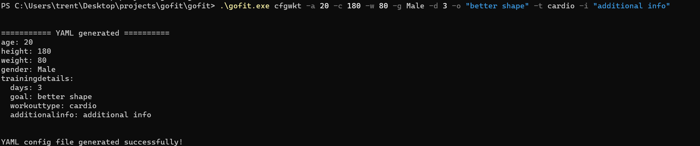
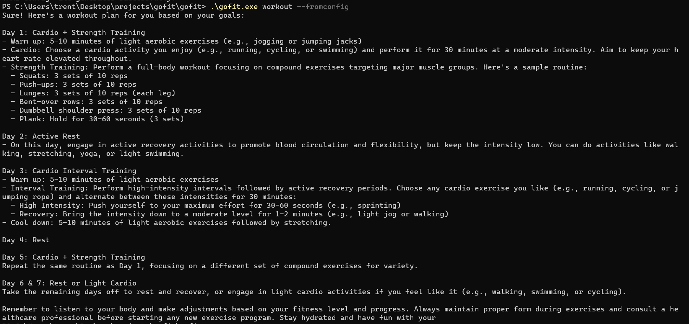

# gofit

**gofit** is a CLI Utility built with Golang which invokes ChatGPT's endpoint in order to send user-defined requests. **gofit** is at its **rel-0.1** versions, which is still a draft and work in progress: many changes are still to be implemented, such as better command handling, new features and unit tests/exception handling.

**gofit**'s goal is that of helping the user requesting a workout plan to ChatGPT, by either leveraging a YAML config file for its workout, or by providing as input the user and training details.

## Tools

- Golang
- [go-resty](https://github.com/go-resty/resty)
- [Cobra](https://github.com/spf13/cobra)
- [ChatGPT](https://chat.openai.com/)

# ChatGPT Usage Warnings

**WARNING**: **gofit** does not bill the user for its usage, but in order to request ChatGPT a workout plan, an APIKEY must be provided through 'gofit --cfggpt' command. The user musy have a valid ChatGPT account with billing details, and billing will be based upon the plan the user chooses on its own ChatGPT account. The **max number of tokens** parameter can be set in the ChatGPT config file to truncate ChatGPT reponses and limit the billing, as well as ChatGPT billing details, thresholds and limits which can be set in the account.

See [here](https://platform.openai.com/docs/guides/gpt) for more information.

**WARNING**: gofit does not retain user data, but all the data provided in config files or input to the 'workout' command will be used by ChatGPT according to its settings.
See [here](https://help.openai.com/en/articles/7730893-data-controls-faq) for more information.

# Usage

## Creating a ChatGPT config file

**gptConfig.yaml** is a .yaml file where all the information required for ChatGPT connection is stored. The file looks like this:

```
apikey: myapikey
endpoint: https://api.openai.com/v1/chat/completions
model: gpt-3.5-turbo
maxtokens: 500
```

The **gptConfig.yaml** file can either be provided directly by the user or generated through the execution of the **cfggpt** command, as follows:

```
gofit cfggpt --apikey myapikey --endpoint https://api.openai.com/v1/chat/completions --model gpt-3.5-turbo --maxtokens 500
```



The **gptConfig.yaml** file is a hard prerequisite for running **gofit**. **endpoint**, **model** and **maxtokens** parameters can be any of the ones documented [here](https://platform.openai.com/docs/guides/gpt). If the user wishes to edit this configuration file, he can either delete it and then re-generate it through the **cfggpt** command, or directly edit the file itself. Currently, the file must be store under the working directory of the **gofit** binary file, otherwise it won't be located.

## Creating a Workout config file

The **workoutConfig.yaml** file is not mandatory for the execution of the **workout** command; however, it can be generated through the **cfgwkt** command or provided directly by the user so to have a central point from which the **workout** parameters can be provided to the CLI. The file looks like this:

```
age: 18
height: 175
weight: 81
gender: Male
trainingdetails:
  days: 3
  goal: better shape
  workouttype: cardio
  additionalInfo: I want to work out for 45 minutes.
```

It can be generated through the **cfgwkt** command as follows:

```
gofit cfgwkt --age 18 --height 175 --weight 81 --gender Male --days 3 --goal "better shape" --type cardio --info "I want to work out for 45 minutes."
```



There is also a **"--edit"** option which, if the file has already been correctly generated, lets the user modify it through command line interactively.

```
gofit cfgwkt --edit
```

The **workoutConfig.yaml** file must be placed at the same directory level of the **gofit** binary to be located.

## Generating a workout plan

Upon the creation of a correct **gptConfig.yaml** file, the user may leverage the **workout** command in order to request a new workout plan from ChatGPT engine.
If the user created a **workoutConfig.yaml** file, this can be done through the execution of the following command:

```
gofit workout --fromconfig
```



Otherwise, the user can also provide as input the workout details directly through command line, as follows:

```
gofit workout --age 18 --height 175 --weight 81 --gender Male --days 3 --goal "better shape" --type cardio --info "I want to work out for 45 minutes."
```

# What's next

- Unit tests: need more of them, alsdo to test exceptions and borderline use cases;
- Better exception handling;
- Desired feature: provide config files path by input, so they do not need to be stored at the same level of the gofit binary;
- ChatGPT response parser/outputfile (.pdf) with workout plan, workout plan editor;
